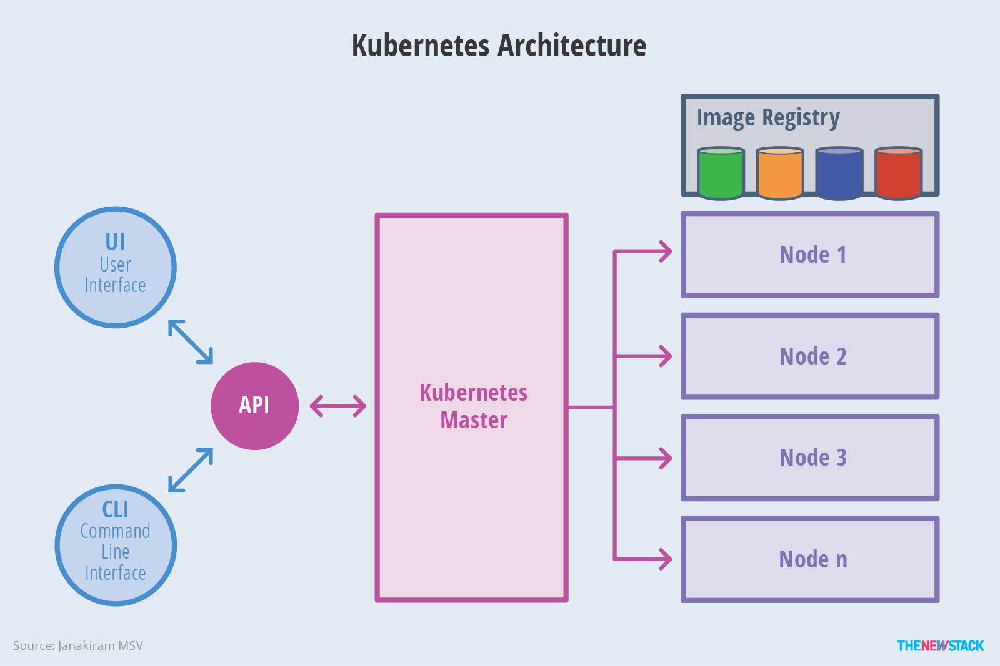

# Kubernetes Best Practices

## Kubernetes架构

Kubernetes 借鉴了Borg的设计理念，比如Pod、Service、Label和单Pod单IP等。Kubernetes的整体架构跟Borg非常像，如下图所示。

Kubernetes主要由以下几个核心组件组成：

- etcd保存了整个集群的状态；
- apiserver提供了资源操作的唯一入口，并提供认证、授权、访问控制、API注册和发现等机制；
- controller manager负责维护集群的状态，比如故障检测、自动扩展、滚动更新等；
- scheduler负责资源的调度，按照预定的调度策略将Pod调度到相应的机器上；
- kubelet负责维护容器的生命周期，同时也负责Volume（CSI）和网络（CNI）的管理；
- Container runtime负责镜像管理以及Pod和容器的真正运行（CRI）；
- kube-proxy负责为Service提供cluster内部的服务发现和负载均衡；

除了核心组件，还有一些推荐的插件，其中有的已经成为CNCF中的托管项目：

- CoreDNS负责为整个集群提供DNS服务
- Ingress Controller为服务提供外网入口
- Prometheus提供资源监控
- Dashboard提供GUI
- Federation提供跨可用区的集群

## Kubernetes' high-level component architecture

下图清晰表明了Kubernetes的架构设计以及组件之间的通信协议。

## Kubernetes架构示意图

### kubernetes整体架构示意图

下面是更抽象的一个视图：

### Master架构

### Node架构

## Kubernetes中的网络

Kubernetes中的网络要解决的网路偶要解决的核心问题就是每台主机的IP地址的网段划分,以及单个容器的IP地址分配。概况为：

- 保证每个Pod拥有一个集群内唯一的IP地址
- 保证不同节点的IP地址划分不会重复
- 保证跨节点的Pod可以互相通信
- 保证不同节点的Pod可以与跨节点的主机互相通信

为了解决该问题，出现了一系列开源的Kubernetes中的网络插件与方案，如：
- flannel
- calico
- contiv
- weave net
- kube-router
- cilium
- canal

还有很多就不一一列举了，只要实现Kubernetes官方的设计的CNI - Container Network Interface（容器网络接口）就可以自己写一个网络插件。

## 资源对象

我将它们简单的分类为以下几种资源对象：

| 类别     | 名称                                                         |
| :------- | ------------------------------------------------------------ |
| 资源对象 | Pod、ReplicaSet、ReplicationController、Deployment、StatefulSet、DaemonSet、Job、CronJob、HorizontalPodAutoscaling、Node、Namespace、Service、Ingress、Label、CustomResourceDefinition |
| 存储对象 | Volume、PersistentVolume、Secret、ConfigMap                  |
| 策略对象 | SecurityContext、ResourceQuota、LimitRange                   |
| 身份对象 | ServiceAccount、Role、ClusterRole                            |

## Init 容器
## Pause 容器
## Pod的生命周期

### Configure Liveness and Readiness Probes

https://kubernetes.io/docs/tasks/configure-pod-container/configure-liveness-readiness-probes/

## Pod Hook

### Attach Handlers to Container Lifecycle Events
https://kubernetes.io/docs/tasks/configure-pod-container/attach-handler-lifecycle-event/

## 参考资料
https://jimmysong.io/kubernetes-handbook/